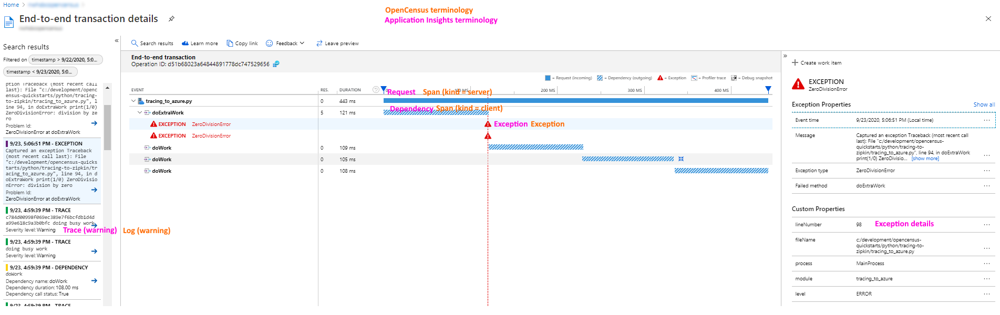

# Opencensus to Azure
Use opencensus to upload Logs, Traces and Metrics to Azure Application Insights

# Instructions

1. Clone the repo 
2. Rename .env.sample to .env
3. Set your application insights key in the .env file
4. Create a virtual environment ```python -m venv .venv```
5. ```pip install -r requirements.txt```
6. Run the python file ```tracing_to_azure.py```

# Illustrates the following in Application Insights


